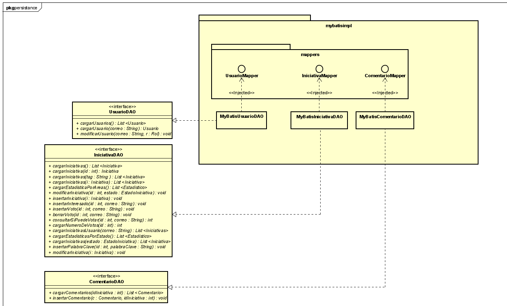
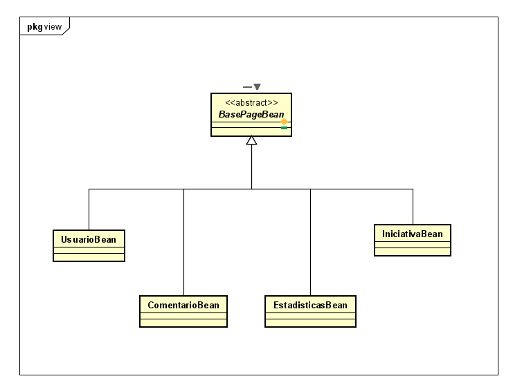
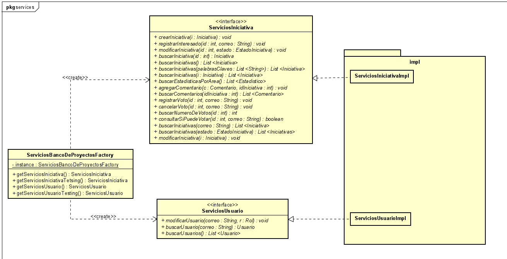

# ECI-Banco-de-Proyectos

## Descripción Detallada

El sistema, más allá de facilitar el registro de las iniciativas e ideas de proyectos, es una valiosa base de conocimiento donde los diferentes actores pueden revisar si hay iniciativas, ideas o intereses similares y aunar esfuerzos para la materialización. Adicional a lo anterior, el personal académico puede integrar a los estudiantes de diferentes asignaturas o proyectos de grado para su realización, materializando las iniciativas para el beneficio de toda la comunidad universitaria. La PMO puede priorizar las iniciativas viables, asignar responsables, gestionar la asignación de recursos, llevar métricas e identificar grupos de interés -a través del tiempo- que se van presentando para cada iniciativa. Con esto se espera lograr no solo la realización de los proyectos sino una aplicación práctica de los conocimientos adquiridos por los estudiantes dentro de las asignaturas de la Escuela generando un ambiente de aprendizaje colaborativo.

## Arquitectura y Diseño
Se diseñó una arquitectura de 4 capas, separando la aplicación en componentes que se sitúan en diferentes niveles funcionales.
### Capas
- Capa de Persistencia

En esta capa se encuentra todos aquellos componentes cuya funcionalidad está centrada en recuperar y/o almacenar los datos con los que trabaja nuestra aplicación.

- Capa de Negocio (Modelo)

Es la que soporta toda la lógica de negocio. En esta capa encontramos todas aquellas funciones que hacen algún tipo de tratamiento de los datos, se aplica las reglas de negocio, etc.

- Capa de Interfaz de Usuario (Vista y Controlador)

Orientada a soportar la interactividad de los usuarios con las funcionalidades brindadas por la capa de negocio. En esta capa se encuentran los controles visuales, formularios, etc.

- Capa de Servicios

Esta capa permite desacoplar la interfaz de usuario del resto de capas, permitiendo que las funcionalidades de nuestra aplicación sean accesible por otras aplicaciones u servicios.

### Diagrama de clases
  + Paquete de Entidades
    
    

### Diagrama Entidad Relacion
  + Modelado Físico de la Base de Datos
  
  
 - Enlace a la aplicación en Heroku: 
 https://eci-banco-de-proyectos.herokuapp.com/
 
 - Enlace al Sistema de Integración Continua: 
 

## Proceso de Desarrollo 

### Marco de Trabajo

Se decidió implementar el framework ***SCRUM***, debido a su alta capacidad para generar productos entregables en un corto tiempo. Ademas del desarrollo colaborativo y la flexibilidad a la hora de trabajar. Por medio de las iteraciones (Sprints) que se realizan es posible tener una retroalimentación constante, para ajustar el ritmo de trabajo. 

### Integrantes

|   *TEAM*                      |        *ROL*                |
|-------------------------------|-----------------------------|
|`Oscar Ospina`                 |`Product Owner`              |
|`Laura Bernal`                 |`Team Developer`             |
|`Davor Cortés`                 |`Scrum Master`               |
|`Juan Sebastian Diaz`          |`Team Developer`             |
|`Juan Camilo Ortiz`            |`Team Developer`             |

- Enlace a Taiga:  https://tree.taiga.io/project/d4v0r-plataforma-banco-de-iniciativas-de-proyectos/backlog

### Sprints
__Sprint 1__

__Sprint 2__

- Reporte de análisis estático de código: 

> Universidad: _Escuela Colombiana de Ingeniería_
>
> Asignatura:  _Ciclos de Vida del Desarrollo de Software_
>
> 2020-1

